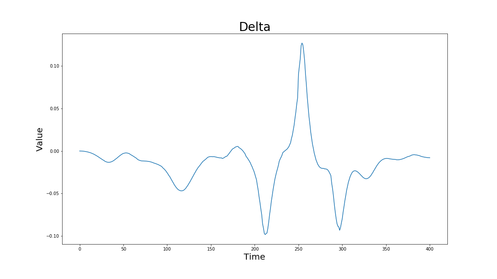
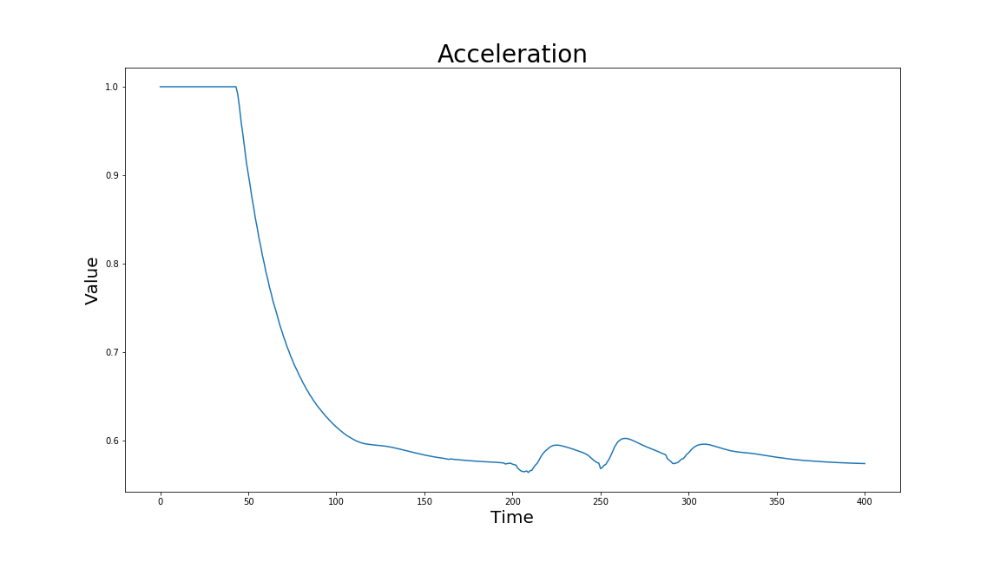
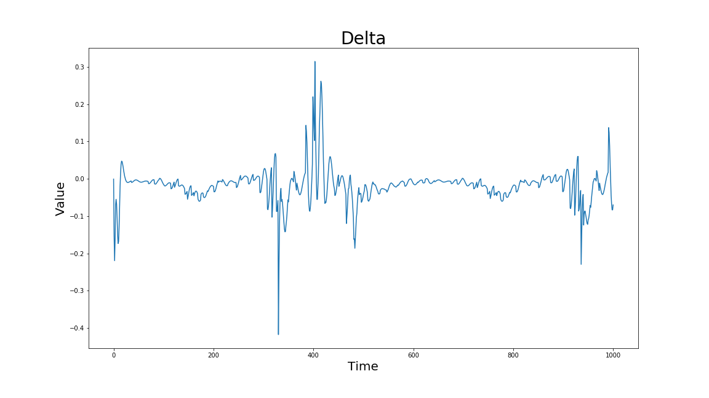
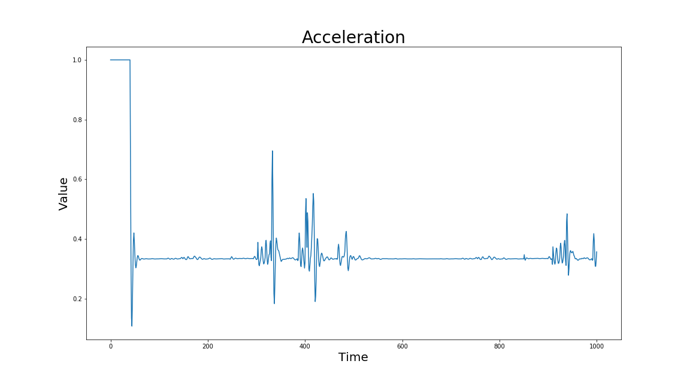

# CarND-Controls-MPC
Self-Driving Car Engineer Nanodegree Program

---

## The Model

The model consists of 6 parameters for the state: <b>x</b>, <b>y</b>, <b>&psi;</b>, <b>velocity</b>, <b>cte (cross track error)</b>, and <b>e&psi; (error &psi;)</b>.  

<b>x</b>, <b>y</b>, <b>&psi;</b>, and <b>velocity</b> are related to the vehicle.  
<b>cte</b> and <b>e&psi;</b> are related to the errors in the vehicles position and orientation.

The update equations for the model are as follows:

| Equation  | Description  |
|---|---|
| <b>x<sub>t+1</sub> = x<sub>t</sub> + cos(&psi;) * dt</b>  | Updates vehicles longitudinal position  |
| <b>y<sub>t+1</sub> = y<sub>t</sub> + sin(&psi;) * dt</b>  | Updates vehicles lateral position  |
| <b>&psi;<sub>t+1</sub> = &psi;<sub>t</sub> + (v<sub>t</sub> &divide; L<sub>f</sub>)  &delta;<sub>t</sub> * dt</b>  | Updates vehicles orientation.  |
| <b>v<sub>t+1</sub> = v<sub>t</sub> + a<sub>t</sub> * dt</b>  | Updates vehicles magnitudinal velocity. |
| <b>cte<sub>t+1</sub> = f(x<sub>t</sub>) - y<sub>t</sub> + sin(e&psi;) * dt</b> | Updates cross track error  |
| <b>e&psi;<sub>t+1</sub> = e&psi;<sub>t</sub> - e&psi;des<sub>t</sub> + (v<sub>t</sub> &divide; L<sub>f</sub>)  &delta;<sub>t</sub> * dt</b>  | Updates steering angle error  |

The meaning of each parameter is described in the following table:

| Parameter  | Description  |
|---|---|
| <b>x</b>  | Vehicles longitudinal position  |
| <b>y</b>  | Vehicles lateral position  |
| <b>&psi;</b>  | Vehicles orientation  |
| <b>v</b>  | Vehicles magnitudinal velocity  |
| <b>&delta;</b>   | Control input for steering angle (Limited between -25 and 25 degrees)  |
| <b>a</b>  | Control input for throttle (limited between -1 and 1). |
| <b>cte</b>  | Cross track error  |
| <b>e&psi;</b>  | Orientation error  |
| <b>L<sub>f</sub></b>  | Measures the distance between the center of mass of the vehicle and it's front axle  |

## Timestep Length & Elapsed Duration (N & dt)

The final N and dt values are `N = 10` and `dt = 0.08`.  The starting value for N and dt was `N = 10` and `dt = 0.1` and was adjusted again after adding weights to the errors.  Once the vehicle moved around the track successful, N and dt were adjust for improvements. If N is higher the car will start to steer badly and if it is lower the steering reacts slowly holding dt constant. The other downside of a high N value is that the calculation takes more time, but may not be noticeable on a fast PC.  However, in the embedded world this will be very noticeable and expensive to have a high N value. I believe that other values of N and dt will work, but will require adjusting the weights again.  Also increasing the speed of the vehicle had a big impact to the configuration of the weights. I was able to achieve a speed around 65mph with this configuration.

## Polynomial Fitting and MPC Preprocessing

The waypoints are converted from the simulators map perspective to the vehicles perspective.  The transformation equations are as follows:

x<sub>m</sub> = x<sub>p</sub> + (cos(&theta;) __*__ x<sub>c</sub>) - (sin(&theta;) __*__ y<sub>c</sub>)

y<sub>m</sub> = y<sub>p</sub> + (cos(&theta;) __*__ x<sub>c</sub>) - (sin(&theta;) __*__ y<sub>c</sub>)

However, the equations need to be modified.  The waypoints needed to be mapped to the vehicles current position, so the difference of the two must be calculated and plugged in for <b>x<sub>c</sub></b> and <b>y<sub>c</sub></b>. Thus placing the waypoints using the vehicle as the origin. <b>x<sub>p</sub></b> and <b>y<sub>p</sub></b> are set to zero since the vehicle is the origin.  The modified equations are as follows:

x<sub>m</sub> = (cos(-&theta;) __*__ x<sub>c</sub>) - (sin(-&theta;) __*__ y<sub>c</sub>) where <b>x<sub>c</sub></b> is the difference between the global x waypoint and the global x position.

y<sub>m</sub> = (cos(-&theta;) __*__ x<sub>c</sub>) - (sin(-&theta;) __*__ y<sub>c</sub>) where <b>x<sub>c</sub></b> is the difference between the global y waypoint and the global y position.

The code below shows an example using the C language.

```C
vector<double> ptsx = {-32.16173,-43.49173,-61.09,-78.29172,-93.05002,-107.7717};
vector<double> ptsy = {113.361,105.941,92.88499,78.73102,65.34102,50.57938};
double px = -40.62008;
double py = 108.7301;
double psi = 3.733667;

for(unsigned int i = 0; i < ptsx.size(); i++)
{
  ptsx[i] = (cos(theta) * (ptsx[i]-px)) - (sin(theta) * (ptsy[i]-py));
  ptsy[i] = (sin(theta) * (ptsx[i]-px)) + (cos(theta) * (ptsy[i]-py));
}

// Result (ptsx, ptsy)
(-9.60304, 0.877815)
(3.9394,0.711732)
(25.8285,1.72411)
(48.0013,3.86886)
(67.7203,6.74332)
(88.1744,10.7764)
```

The following table gives a description of the parameter.

| Parameter  | Description  |
|---|---|
| <b>px</b>  | The global x position of the vehicle  |
| <b>py</b>  | The global x position of the vehicle  |
| <b>ptsx</b>  | The global x positions of the waypoints  |
| <b>ptsy</b>  | The global y positions of the waypoints  |
| <b>theta</b>  | Vehicle Orientation  |

Next, the converted waypoints are used to generate a 3rd order polynomial using the `polyfit()` function.  The reason a 3rd order polynomial is used is due to the fact that it can represent most curves found on roads.  The 3rd order polynomial is also used to calculate the cross track error (cte) and the orientation error (e&psi;).  The cte and e&psi; are calculated using the C language as follows:

```C
// Calculate the cross track error
double cte = polyeval(coeffs, px) - py;
// Calculate the orientation error
double epsi = psi - atan(coeffs[1]);  
```

The orientation error (<b>e&psi;</b>) is calculated using the derivative of the 3rd order polynomial.  Only the first order coefficient is needed because <b>x</b>, <b>y</b>, <b>&psi;</b> are all set to zero because the vehicle is always the origin (center of the coordinate system).

Next <b>x</b>, <b>y</b>, <b>&psi;</b>, <b>velocity</b>, <b>cte</b>, and <b>e&psi;</b> are all feed into the `Solve()` function. The function optimizes the outputs (<b>&delta;</b> and <b>acceleration</b>) based on cost and constraints. <b>&delta;</b> is constraint between -25 and 25 degrees. <b>Acceleration</b> is constrained between -1 and 1.  

The chosen weights for each error is shown in the code below. There is one addition error that was added outside of what was shown in the Udacity lessons and that is the relationship between speed and steering angle.

```C
fg[0] = 0;

for (unsigned int t = 0; t < N; t++) {
  // Cross track error cost
  fg[0] += 1*CppAD::pow(vars[cte_start + t], 2);
  // Psi error cost
  fg[0] += 1*CppAD::pow(vars[epsi_start + t], 2);
  // Speed cost
  fg[0] += 1*CppAD::pow(vars[v_start + t] - ref_v, 2);
}

for (unsigned int t = 0; t < N-1; t++) {
  fg[0] += 5000*CppAD::pow(vars[delta_start + t], 2);
  // Note adding weight to acceleration error cause a lower velocity, so ref_v must be increase to adjusted for the target speed.
  fg[0] += 25*CppAD::pow(vars[a_start + t], 2);
  //Prevents oscillations around curves.
  fg[0] += 2.8*CppAD::pow(vars[v_start + t]*vars[delta_start + t], 2);

}

for (unsigned int t = 0; t < N-2; t++) {
  fg[0] += 600*CppAD::pow(vars[delta_start + t + 1] - vars[delta_start + t], 2);
  fg[0] += 300*CppAD::pow(vars[a_start + t + 1] - vars[a_start + t], 2);
}
```

The output <b>&delta;</b> and <b>acceleration</b> values are used for setting the vehicles steering angle and throttle controls.  However, <b>&delta;</b> must be divided by the radian equivalent of 25 degrees for normalization. The process is repeated for each iteration (Convert waypoints --> calculate cross track and orientation errors --> update the state --> optimize the cost --> set the actuators).

Below are graphs plotting &delta; (delta) and acceleration for one lap around the track. Delta and acceleration are quite smooth compared with the initial graphs.  The initial graphs had many spikes, but after tuning, they have become much smoother and thus resulted in a smooth ride versus and an overly reactive ride.

Final graphs:





Initial graphs before extensive tuning:





## Model Predictive Control with Latency

The error weights, N, and dt values were tuned with a 100ms delay.  When I removed the 100ms latency the car behaved similarly, but when set to 200ms the car didn't make it around the track.  The vehicle continues on its current trajectory until the next actuation command, so there is some overshoots due to this.  However, they are minimal enough for a smooth ride around the track.  

## MP4 Video

A video is attached to show how the vehicle drives around the track.

`video/run.mp4`

# Udacity Readme Content Section

## Dependencies

* cmake >= 3.5
 * All OSes: [click here for installation instructions](https://cmake.org/install/)
* make >= 4.1(mac, linux), 3.81(Windows)
  * Linux: make is installed by default on most Linux distros
  * Mac: [install Xcode command line tools to get make](https://developer.apple.com/xcode/features/)
  * Windows: [Click here for installation instructions](http://gnuwin32.sourceforge.net/packages/make.htm)
* gcc/g++ >= 5.4
  * Linux: gcc / g++ is installed by default on most Linux distros
  * Mac: same deal as make - [install Xcode command line tools]((https://developer.apple.com/xcode/features/)
  * Windows: recommend using [MinGW](http://www.mingw.org/)
* [uWebSockets](https://github.com/uWebSockets/uWebSockets)
  * Run either `install-mac.sh` or `install-ubuntu.sh`.
  * If you install from source, checkout to commit `e94b6e1`, i.e.
    ```
    git clone https://github.com/uWebSockets/uWebSockets
    cd uWebSockets
    git checkout e94b6e1
    ```
    Some function signatures have changed in v0.14.x. See [this PR](https://github.com/udacity/CarND-MPC-Project/pull/3) for more details.

* **Ipopt and CppAD:** Please refer to [this document](https://github.com/udacity/CarND-MPC-Project/blob/master/install_Ipopt_CppAD.md) for installation instructions.
* [Eigen](http://eigen.tuxfamily.org/index.php?title=Main_Page). This is already part of the repo so you shouldn't have to worry about it.
* Simulator. You can download these from the [releases tab](https://github.com/udacity/self-driving-car-sim/releases).
* Not a dependency but read the [DATA.md](./DATA.md) for a description of the data sent back from the simulator.


## Basic Build Instructions

1. Clone this repo.
2. Make a build directory: `mkdir build && cd build`
3. Compile: `cmake .. && make`
4. Run it: `./mpc`.

## Tips

1. It's recommended to test the MPC on basic examples to see if your implementation behaves as desired. One possible example
is the vehicle starting offset of a straight line (reference). If the MPC implementation is correct, after some number of timesteps
(not too many) it should find and track the reference line.
2. The `lake_track_waypoints.csv` file has the waypoints of the lake track. You could use this to fit polynomials and points and see of how well your model tracks curve. NOTE: This file might be not completely in sync with the simulator so your solution should NOT depend on it.
3. For visualization this C++ [matplotlib wrapper](https://github.com/lava/matplotlib-cpp) could be helpful.)
4.  Tips for setting up your environment are available [here](https://classroom.udacity.com/nanodegrees/nd013/parts/40f38239-66b6-46ec-ae68-03afd8a601c8/modules/0949fca6-b379-42af-a919-ee50aa304e6a/lessons/f758c44c-5e40-4e01-93b5-1a82aa4e044f/concepts/23d376c7-0195-4276-bdf0-e02f1f3c665d)
5. **VM Latency:** Some students have reported differences in behavior using VM's ostensibly a result of latency.  Please let us know if issues arise as a result of a VM environment.

## Editor Settings

We've purposefully kept editor configuration files out of this repo in order to
keep it as simple and environment agnostic as possible. However, we recommend
using the following settings:

* indent using spaces
* set tab width to 2 spaces (keeps the matrices in source code aligned)

## Code Style

Please (do your best to) stick to [Google's C++ style guide](https://google.github.io/styleguide/cppguide.html).

## Project Instructions and Rubric

Note: regardless of the changes you make, your project must be buildable using
cmake and make!

More information is only accessible by people who are already enrolled in Term 2
of CarND. If you are enrolled, see [the project page](https://classroom.udacity.com/nanodegrees/nd013/parts/40f38239-66b6-46ec-ae68-03afd8a601c8/modules/f1820894-8322-4bb3-81aa-b26b3c6dcbaf/lessons/b1ff3be0-c904-438e-aad3-2b5379f0e0c3/concepts/1a2255a0-e23c-44cf-8d41-39b8a3c8264a)
for instructions and the project rubric.

## Hints!

* You don't have to follow this directory structure, but if you do, your work
  will span all of the .cpp files here. Keep an eye out for TODOs.

## Call for IDE Profiles Pull Requests

Help your fellow students!

We decided to create Makefiles with cmake to keep this project as platform
agnostic as possible. Similarly, we omitted IDE profiles in order to we ensure
that students don't feel pressured to use one IDE or another.

However! I'd love to help people get up and running with their IDEs of choice.
If you've created a profile for an IDE that you think other students would
appreciate, we'd love to have you add the requisite profile files and
instructions to ide_profiles/. For example if you wanted to add a VS Code
profile, you'd add:

* /ide_profiles/vscode/.vscode
* /ide_profiles/vscode/README.md

The README should explain what the profile does, how to take advantage of it,
and how to install it.

Frankly, I've never been involved in a project with multiple IDE profiles
before. I believe the best way to handle this would be to keep them out of the
repo root to avoid clutter. My expectation is that most profiles will include
instructions to copy files to a new location to get picked up by the IDE, but
that's just a guess.

One last note here: regardless of the IDE used, every submitted project must
still be compilable with cmake and make./

## How to write a README
A well written README file can enhance your project and portfolio.  Develop your abilities to create professional README files by completing [this free course](https://www.udacity.com/course/writing-readmes--ud777).
